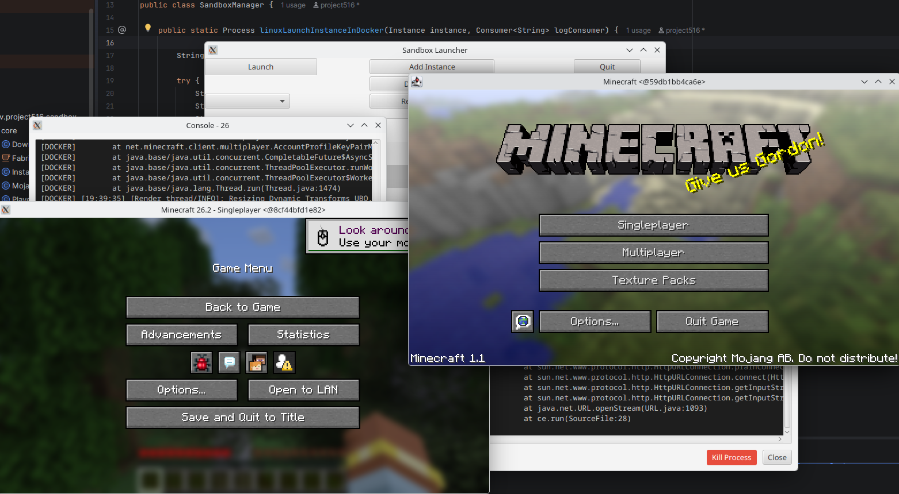

# sandbox-launcher

A JavaFX Minecraft launcher that launches Minecraft in a sandbox environment.



Each Minecraft instance runs inside an isolated Docker container with the correct Java version for that Minecraft release. No mod loaders or game files leak between instances.

## Features

- Install multiple isolated Minecraft instances
- Launch instances inside Docker containers with automatic Java version selection
- Change instance name and icon
- Change your player username
- Support for Fabric, Forge, and NeoForge mod loaders
- Support for old Minecraft versions (1.5 and below via Betacraft proxy)
- Progress bars for downloads
- Console output viewer for running instances
- Kill button for running instances

## Requirements

- **Linux** (X11 display server required)
- **Java 25** - [Eclipse Temurin](https://adoptium.net/temurin/releases?version=25&os=any&arch=any) recommended
- **Docker Engine** - [Docker Engine](https://docs.docker.com/engine/) is sufficient, Docker Desktop is not required

> Windows and Mac are not supported. It may be possible to use an X server (VcXsrv, XQuartz) but this has not been tested.

## Installation

1. Download the latest `sandbox-launcher.zip` from [Releases](https://github.com/Project516/sandbox-launcher/releases)
2. Extract the zip
3. Run the launcher binary inside the extracted directory

Docker images for each Java version are pulled automatically from GHCR on first launch. No manual setup of Docker images is needed.

## Setup for Development

1. Clone the repository
2. Run `./gradlew run` to launch the project

Docker images are pulled automatically at runtime. If you want to build them locally instead:

```sh
docker/build-docker.sh
```

## X11 / Audio Setup

If you are running inside Docker or having display/audio issues, run the fix script:

```sh
bash fix-docker.sh
```

This enables X11 access for Docker containers and sets up PulseAudio forwarding.
